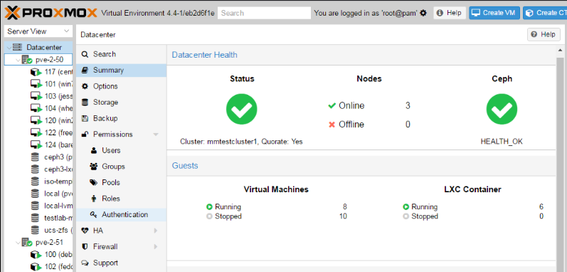

**Proxmox Virtual Environment** é uma plataforma de código aberto para virtualização de servidores que permite executar máquinas virtuais (KVM Hypervisor) e containers (LXC) no mesmo ambiente. Esse sistema operacional Linux permite a criação e gestão simplificada de uma estrutura hiperconvergente.

Com ele é possível dimensionar recursos de computação e armazenamento de forma escalável, partindo de um único nó e expandindo a estrutura até um grande cluster capaz de acomodar altas cargas de trabalho.

Com uma única interface de gerenciamento baseada na web, o Proxmox integra ferramentas para configurar alta disponibilidade entre servidores, armazenamento definido por software, rede e recuperação de desastres.

O sistema suporta virtualmente qualquer configuração de hardware, desde pequenos servidores físicos até grandes soluções multiprocessadas conectadas a soluções SAN.

### Principais Características do proxmox?
**Virtualização de Máquinas e Containers:** O Proxmox VE suporta a criação e o gerenciamento de Máquinas Virtuais (VMs) e containers. Ele usa o QEMU para a virtualização completa e o LXC para a virtualização baseada em container.

**Interface web para gerenciamento:** O sistema oferece uma interface web fácil de usar, que permite a gestão completa do ambiente a partir de um navegador, sem a necessidade de usar a linha de comando.

**Alta disponibilidade:** Uma plataforma Proxmox VE suporta a formação de clusters com alta disponibilidade para servidores, VMs e containers. Isso é vital para garantir que os serviços estejam sempre disponíveis, mesmo em caso de falha de um dos nós.

**Armazenamento distribuído:** O Proxmox suporta uma variedade de unidades de armazenamento em disco ou flash distribuídos. Isso inclui Ceph, GlusterFS, ZFS e outras soluções de armazenamento local e de rede.

**Backup e restauração:** O sistema operacional possui ferramentas integradas para backup e recuperação de máquinas virtuais e containers.

**Firewall e segurança:** O software possui ainda um firewall integrado que pode ser configurado individualmente por host, máquinas virtuais individuais ou containers.

**Migração ao vivo:** A plataforma também suporta a migração ao vivo de máquinas virtuais e containers, permitindo assim mover, sem interrupções, uma máquina em execução de um host físico para outro.

**API aberta:** O Proxmox VE possui uma API RESTful integrada, que permite fácil gerenciamento com sistemas existentes e a criação de automação para tarefas comuns.

